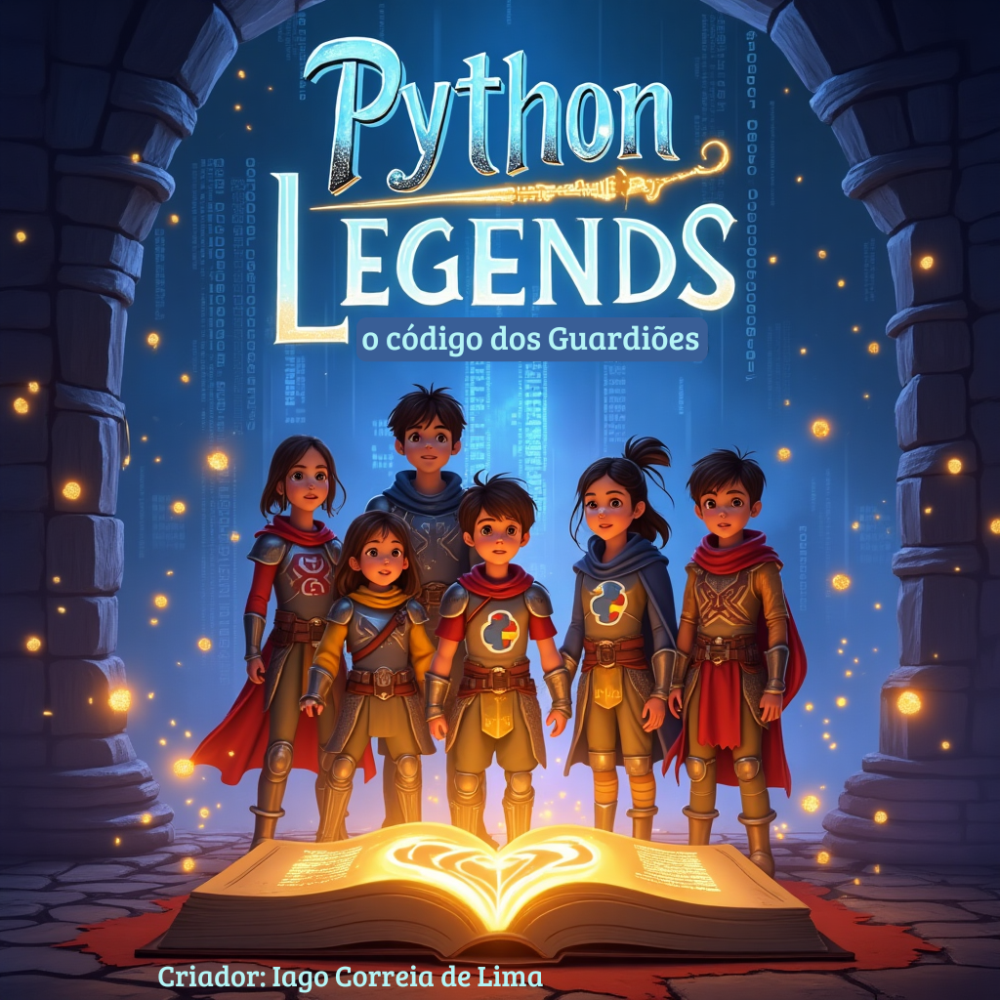

# 🐍 Python: A Lenda dos Guardiões

  
  
  **Um E-book Educativo de Python com Temática RPG**
  
  
  
  

---

## 📖 **Sobre o Projeto**

"Python: A Lenda dos Guardiões" é um e-book educativo que ensina programação Python para crianças e adolescentes através de uma aventura épica inspirada em jogos de RPG.

### 🎯 **Objetivo**
Tornar o aprendizado de Python divertido e acessível, transformando conceitos técnicos em uma jornada mágica repleta de personagens cativantes e desafios épicos.

### 👥 **Público-Alvo**
- Crianças e adolescentes (10-17 anos)
- Iniciantes em programação
- Educadores buscando material didático criativo
- Entusiastas de RPG interessados em programação

---

## 📚 **Estrutura do E-book**

### **Capítulos:**
1. 🐍 **O Despertar do Python** - História e origem da linguagem
2. 💎 **A Pedra das Variáveis** - Introdução às variáveis
3. 🌲 **A Floresta das Condições** - Navegando com IF-ELSE
4. 🏺 **O Baú Mágico: Guardiões de Arrays** - Arrays e Listas
5. 🌀 **O Labirinto dos Laços** - Loops e repetições
6. 📜 **O Grimório das Funções** - Criação e uso de funções

### **Personagens Principais:**
- **Pythonius, o Sábio** - Guardião ancestral da linguagem
- **Guido van Rossum** - O lendário arquimago criador
- **Varina** - Guardiã dos baús (variáveis)
- **Silvanus** - Druida das decisões (condicionais)
- **Arrayus Magnus** - Grande Guardião dos Arrays

---

## 🔗 **Links Importantes**

### 📄 **Artigo sobre o Processo Criativo**
👉 **[LEIA O ARTIGO COMPLETO AQUI](docs/artigo-processo-criativo.md)**

*Este artigo detalha todo o processo de criação do e-book, desde a concepção da ideia até a implementação final, incluindo as técnicas de prompt engineering utilizadas com IA.*

### 📖 **Download do E-book**
- [📘 Versão PDF Completa](ebook/ebook-completo.pdf)
- [📝 Versão Markdown por Capítulos](ebook/)

---

## 🛠️ **Processo de Criação**

Este projeto foi desenvolvido utilizando técnicas avançadas de **Prompt Engineering** com IA, documentadas em:

- [📝 Prompts Utilizados](prompts/)
- [🔄 Processo Iterativo](docs/artigo-processo-criativo.md)

---

## 📊 **Métricas do Projeto**

- **📄 Páginas:** ainda não definido 
- **📝 Palavras:** ainda não definido 
- **🏷️ Capítulos:**  capítulos completos  (1) , capítulos em andamento (2,3,4,5,6)
- **👥 Personagens:** ainda não definido 
- **💻 Exemplos de Código:** ainda não definido 
- **⏱️ Tempo de Desenvolvimento:** 1 semanas

---

## 🎯 **Como Usar Este Material**

### **Para Estudantes:**
1. Leia os capítulos em ordem
2. Pratique os exemplos de código
3. Complete as "quests" ao final de cada capítulo
4. Junte-se à comunidade Python!

### **Para Educadores:**
1. Use como material complementar
2. Adapte as atividades para sua turma
3. Explore os prompts para criar conteúdo similar
4. Compartilhe feedback e sugestões

---

## 🤝 **Como Contribuir**

1. **Fork** este repositório
2. Crie uma **branch** para sua contribuição (`git checkout -b melhoria/nova-funcionalidade`)
3. **Commit** suas mudanças (`git commit -am 'Adiciona nova funcionalidade'`)
4. **Push** para a branch (`git push origin melhoria/nova-funcionalidade`)
5. Abra um **Pull Request**

---

## 📜 **Licença**

Este projeto está sob a licença **MIT**. Veja o arquivo [LICENSE](LICENSE) para mais detalhes.

---

## 👨‍💻 **Autor**

**IAGO**
- 💼 LinkedIn: [https://www.linkedin.com/in/iago-lima-97bb53233/]
- 🐱 GitHub: [(https://github.com/iagob2)]
- 📧 Email: [iagolimab2@gmail.com]

---

## 🙏 **Agradecimentos**

- **Guido van Rossum** - Criador do Python
- **Comunidade Python** - Por tornar programação acessível
- **Educadores** - Que inspiraram esta abordagem didática
- **Família RPG** - Por mostrar que aprender pode ser uma aventura
- **Gustavo Guanabara** - Por me ensinar python

---

## 📈 **Roadmap Futuro**

- [ ] **Volume 2:** Programação Orientada a Objetos
- [ ] **Aplicativo Mobile** com os conteúdos
- [ ] **Jogos Interativos** baseados nos capítulos
- [ ] **Versões em outros idiomas**
- [ ] **Curso Online** complementar

---

